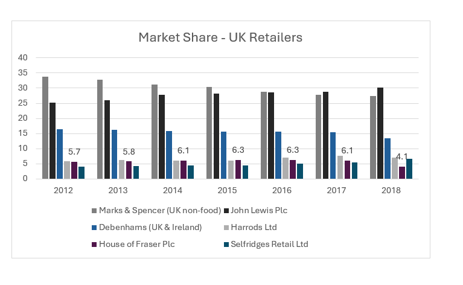

# House of Fraser: Data-Driven Business Failure Analysis

A data-driven business analytics project investigating the decline of House of Fraser using financial, customer, and market data. 

The project applies regression analysis, preprocessing techniques, and strategic evaluation to identify the operational and financial factors behind the retailer’s collapse.

## Overview

This project analyzes the decline and acquisition of House of Fraser (HoF), one of the UK's major department store retailers.

The analysis focuses on:
- branding and marketing weaknesses
- management instability
- declining financial performance
- delayed investment in e-commerce

Using customer, financial, and market data collected from Fame and Mintel reports, the project demonstrates how data analytics can support strategic business evaluation and decision-making.

---

## Objectives

The objectives of this project were to:

- identify the major causes behind House of Fraser’s decline
- evaluate customer perception and market positioning
- analyze financial performance using regression analysis
- assess how branding and operational decisions affected profitability
- provide actionable recommendations using a data-driven approach

---

## Data Sources

Data used in this project was collected from:

- Fame Database
- Mintel Retail Reports
- Public financial statements
- BBC, Drapers, and retail industry articles

The datasets included:
- sales revenue
- operating expenses
- debt levels
- customer satisfaction scores
- market share information
- brand recognition metrics

Some datasets have been simplified or omitted due to licensing and academic restrictions.

---

## Methodology

The project combined Excel and Python workflows to prepare and analyze data.

Key preprocessing steps included:
- removing missing values
- cleaning datasets
- aggregating customer satisfaction metrics
- scaling variables using Min-Max normalization

Two regression models were developed:

1. Sales Revenue Prediction Model
2. Financial Performance Assessment Model

The analysis was conducted using:
- Python
- Pandas
- Scikit-learn
- Excel
- Jupyter Notebook

---

## Technologies Used

- Python
- Pandas
- Scikit-learn
- Matplotlib
- Jupyter Notebook
- Excel

---

## Regression Models

### Model 1: Sales Revenue Prediction

Dependent Variable:
- Sales Revenue

Independent Variables:
- Advertising Spend
- Brand Recognition
- Customer Satisfaction Score

This model explored how marketing and customer metrics influenced revenue performance.

---

### Model 2: Financial Performance Assessment

Dependent Variable:
- Net Profit Margin

Independent Variables:
- Total Revenue
- COGS
- Operating Expenses
- Debt Level
- Interest Expense

This model assessed the relationship between operational costs and profitability.

---

## Key Insights

Key findings from the analysis include:

- House of Fraser lacked a clear brand identity
- Delayed investment in e-commerce reduced competitiveness
- Management instability disrupted long-term strategy
- High operating expenses and debt weakened profitability
- Customer satisfaction positively impacted sales revenue
- Financial performance steadily declined between 2012–2017
---

## Repository Structure

```text
reports/
figures/
code/
data/
```
## Analytical Workflow

The original project analysis was conducted using Excel and Python/Jupyter Notebook workflows. 

Because the original notebooks were not preserved, simplified reconstruction scripts have been included to demonstrate:

- preprocessing logic
- regression methodology
- data cleaning workflow
- statistical modeling structure

These scripts reflect the analytical approach used during the project.
---

## Limitations

Some limitations affected the analysis:

- limited access to proprietary retail datasets
- multicollinearity issues in the second regression model
- restricted word count for deeper critical discussion
- difficulty quantifying management effectiveness using statistical methods

Despite these limitations, the analysis still provided valuable strategic insights into House of Fraser’s decline.

---

## Market Share Analysis



---
## Author

Razan Aziz
